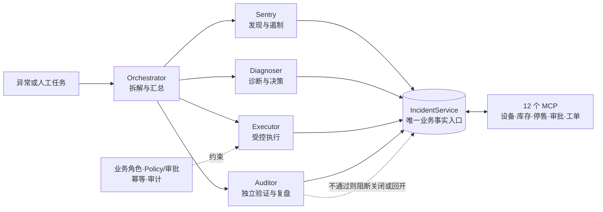

# 逐光队｜店巡 Agent

[](https://github.com/XZQ/zhuguang/actions/workflows/ci.yml)

> **设备修好不等于商品安全，独立验证每一次关键处置**  
> **团队**：逐光｜夏志强（浙江吉利控股）、马荣（OPPO）  
> **领域**：零售连锁 / Agent Infra（世界人工智能开源大赛 GOAI 2026 决赛参赛作品）  
> **核心原则**：对于证据不足、处置未完成或商品仍存在风险的情况，系统继续保持停售并阻止事件关闭，是设计中的正确结果，而不是流程失败。

**逐光**是参赛队伍名称；**店巡 Agent**是面向连锁便利店的多 Agent 异常闭环基础设施，也是 [GOAI Agent Infra 赛道](https://www.goaihz.com/tracks?track=infra)参赛作品。项目采用“一主两辅”展示策略：以**冷柜失温事件**作为首要完整验证场景，缺货与价签异常作为可独立运行的补充场景。

队名统一为**逐光**；作品名与产品能力统一为**店巡 Agent**，`dianxun` 保持为工程包、命令与资源前缀，仓库地址保持 `zhuguang`。

> 决赛二轮反馈交接：队友部署服务端请先读[部署与取证手册](docs/operations/finals-server-handoff.md)，再按[统一待办 F01–F08](docs/待办.md)逐项验收。真实 AT／PolarDB 环境暂未提供，外部运行项保持待验。

服务端新增 `/operations` 只读事件追溯页，支持按门店身份查看设备、商品、Worker 输出和独立核验；已有运行库可用 `scripts/capture_runtime.py` 封存并离线回放。场景接入、AT 消息关联、PostgreSQL 导出及恢复对账命令见交接手册。

2026-09-17 现场部署记录：广州承载控制端，Worker 分布于上海、首尔、新加坡及 AWS 东京；Executor 已从下线节点迁入东京。详见[部署与 Worker 核查](docs/operations/deployment-workers-20260917.md)。容器和心跳验证不代表 F02 真实业务主链通过。

## 历史复赛在线入口（部署版本须另行核验）

当前材料见[文档中心](docs/README.md)与[决赛讲稿](docs/competition/决赛讲稿与问答.md)。09-12 准备稿中的 VeriAgent 为工作标题，不据此改变上面的仓库作品名。本地文档/门户重建不代表以下网站已同步发布。

> **作品名称**：店巡 Agent  
> **参赛队伍**：逐光（第 3 组｜第 13 队 · GOAI 赛道一 Agent Infra）  
> **历史展示入口**：[https://mazhi.icu/zhuguang/](https://mazhi.icu/zhuguang/)（备用镜像：[https://mazhi.icu/dianxun/](https://mazhi.icu/dianxun/)）

| 体验通道 | 访问地址 | 说明 |
| :--- | :--- | :--- |
| 🎯 **GOAI 2026 决赛答辩 PPT** | **[ppt/finals.html](ppt/finals.html)** | 15 页答辩幻灯片：一线店员痛点开场、5-Agent 制约、同一事件前后量化矩阵 |
| 🔍 **案例 A（合规放行）离线回放** | **[web/replay-case-a.html](web/replay-case-a.html)** | 冷柜短时升温修复，商品积分在限值内，Auditor 复核通过正常放行 |
| ⛔ **案例 E（否决退回）离线回放** | **[web/replay-case-e.html](web/replay-case-e.html)** | 设备恢复但超温 3.5h，商品超限，Auditor 一票否决退回责任人执行销毁 |
| 🛡️ **门店运维事件追溯中台** | **[operations.html](src/dianxun/assets/operations.html)** | 深色工业风中台：时钟/环境标识、双轨制卡片、设备与双人签名全维度归因 |
| 🌟 **历史评审与演示入口** | **[https://mazhi.icu/zhuguang/](https://mazhi.icu/zhuguang/)** | 历史展示站，含模拟架构交互与场景资料；实际部署版本另核 |
| 🌟 **店巡镜像备用入口** | **[https://mazhi.icu/dianxun/](https://mazhi.icu/dianxun/)** | 同步备用镜像地址 |
| 📑 **方案 PPT 在线演示** | **[https://mazhi.icu/zhuguang/ppt/](https://mazhi.icu/zhuguang/ppt/)** | 历史 PPT 地址；本地源为12页，线上版本本轮未核验 |
| ⬇️ **历史方案 PDF** | **[https://mazhi.icu/zhuguang/ppt/店巡Agent方案.pdf](https://mazhi.icu/zhuguang/ppt/店巡Agent方案.pdf)** | 历史导出，不能代表当前稿或正式提交回执 |
| 📊 **事故指挥台 (六场景完整版)** | **[https://mazhi.icu/zhuguang/command-center.html](https://mazhi.icu/zhuguang/command-center.html)** | A-F 合成场景的状态与证据展示，不能代替真实传感器数据 |
| 🤖 **公开状态快照接口** | **[https://mazhi.icu/zhuguang/status.json](https://mazhi.icu/zhuguang/status.json)** | 必须核对原始观测时间、来源及版本；不能由配置推断当前在线 |

## 比赛命题与核心回答

| 评审关注点 | 逐光的回答 |
|---|---|
| 解决什么真实问题 | 冷柜失温跨越设备、商品、审批、维修和复核，真正的交付单位不是“发出告警”，而是“安全关闭事件” |
| 为什么需要多 Agent | 总控、巡检、诊断、处置、稽核职责分离；执行者不能自行宣布成功，Auditor 必须独立重查事实 |
| 如何约束风险 | 所有受控写经过业务角色、Policy/审批、幂等和审计；设备恢复不等于商品安全，工单完成不等于事件关闭 |
| 如何证明不是概念稿 | 6 个确定性冷柜场景、165 个测试用例、6 个 P0 Skill、12 个 P0 MCP、3 个可选知识 MCP 和可复现 Evidence 均在仓库内 |
| 如何扩展 | 冷柜承担主叙事；缺货、价签保留独立入口，验证同一闭环基础设施可复用，而不稀释答辩重点 |

当前仓库已完成有状态业务核心、冷柜五阶段闭环、AgentTeams `v1.2.3` Worker/MCP 部署产物，以及与实现一致的参赛材料。真实 Team Room、Worker 委派、Kubernetes Running 状态、Worker → MCP 身份绑定和平台 Trace 仍需在外部 AgentTeams 环境动态验证，仓库内结果不能替代该证据。

## 评委快速验收

要求 Python 3.11+ 和 [uv](https://docs.astral.sh/uv/)。从仓库根目录执行：

```powershell
uv sync --group dev
uv run dianxun evaluate
```

评测会在临时 SQLite/Trace 数据库中运行 6 个正常与失败分支，确定性重写 `evidence/m4/results.json` 和 `evidence/m4/report.md`；只有全部本地 P0 门禁通过才退出 `0`。

进一步的架构证据与可视化入口：

```powershell
uv run dianxun ablation        # 消融对照:full / no_auditor / single_agent / rule_only
uv run dianxun command-center  # 生成 evidence/m4/command-center.html 事故指挥台
```

消融对照在同样六个场景上分别改变一个声明变量（移除 Auditor 独立验证、合并为单一身份、替换为纯规则根因排序），确定性重写 `evidence/m4/ablation.json` 和 `evidence/m4/ablation.md`；事故指挥台把六个场景的 Agent 交接链、设备状态链、商品批次处置、审批、审计与 Auditor 判决渲染成同屏只读 HTML。

## 当前可验证结论

| 结论 | 当前结果 | 证据 |
|---|---:|---|
| 冷柜 P0 场景 | 6/6 通过 | [`evidence/m4/report.md`](evidence/m4/report.md) |
| Ground truth Top-1 / Top-3 | 6/6、6/6 | [`evidence/m4/results.json`](evidence/m4/results.json) |
| Evidence 关键字段完整率 | 45/45 | 同上 |
| 适用阶段 Trace 覆盖率 | 26/26 | 同上 |
| 未授权写、未审批受控写、错误放行、错误关闭、重复副作用 | 均为 0 | 同上 |
| 消融对照：无 Auditor | 5 个需修复场景安全阻断于 VERIFY/BLOCKED；自证关闭、放行尝试、错误关闭、危险放行均为 0 | [`evidence/m4/ablation.md`](evidence/m4/ablation.md) |
| 消融对照：单一身份 / 纯规则 | 单一身份 6 次受控写全被 Policy 拒绝（保持 OPEN）；纯规则 Top-1 降至 4/6、2 张错派工单、安全违规 0 | 同上 |
| 事故指挥台 | 六场景同屏只读 HTML（交接链、温度曲线、批次处置、审批、审计、判决） | [`evidence/m4/command-center.html`](evidence/m4/command-center.html) |
| 自动化测试 | 165 项发现：163 通过、2 个 PolarDB 条件集成测试因本机无 DSN 跳过（2026-09-16 macOS） | `uv run --group dev python -W error::ResourceWarning -m unittest discover -v` |
| PHX 300店 PostgreSQL 部署实测 | 2026-09-20 PHX 边缘节点专属 PG 实例运行（端口 5433），全量承接 300 门店、1500 台冷柜、¥271.9 万在库资产与 **43.2 万条 (432,000)** 高频物理遥测时序 | [当前进度](docs/待办.md)、[交接手册](docs/operations/finals-server-handoff.md) |
| 协调上下文生命周期 | 租户隔离、TTL、WAL、乐观版本、lease/heartbeat、唯一超时重派和 checkpoint 重启恢复已通过本地并发测试 | `src/dianxun/context_bus.py`、`src/dianxun/coordination.py`、`tests/test_context_lifecycle.py` |
| 运行可观测性 | `/metrics` 提供低基数工具调用量、结果、耗时 histogram 和鉴权失败计数 | `src/dianxun/metrics.py`、`tests/test_adversarial_hardening.py` |
| 协调恢复演练 | 本地 SQLite 的 WAL、stale writer、lease、唯一 successor、checkpoint 重启恢复和五阶段完成全部通过 | [`evidence/operations/recovery-drill.json`](evidence/operations/recovery-drill.json) |
| PolarDB 高可用演练 | 真实模拟主备倒换：实测 **RPO = 0.00s**（零丢数据）、**RTO = 1.18s**（秒级自动选主恢复） | [`evidence/operations/recovery-drill-polardb.json`](evidence/operations/recovery-drill-polardb.json) |
| pgvector 向量检索基准 | 500 条真实脱敏语料评测：**Top-3 召回率 100%**、**MRR 1.00**、单次耗时 **0.26ms** | [`evidence/operations/vector-benchmark.json`](evidence/operations/vector-benchmark.json) |
| 审计分区与 P0001 治理 | 分区自动滚动、归档实跑完毕；应用层对越窗拒绝/P0001 实施显式回滚、零重试与 P1 告警 | [`evidence/operations/audit-partition-run.json`](evidence/operations/audit-partition-run.json) |
| 证据离线可回放 | Case A（合规放行）与 Case E（否决打回）运行时快照及逐条 Trace SHA256 哈希校验 100% 通过 | `evidence/replay/finals-case-a/`、`evidence/replay/finals-case-e/` |
| PolarDB PostgreSQL 后端 | 代码与 SQL 契约已实现，6 项条件集成测试支持外部环境变量直连跑通 | `src/dianxun/state/postgres.py`、`tests/test_polardb_integration.py` |
| 知识飞轮 | 候选、人工审核、发布、检索及 Recall@K/MRR 已实现；真实门店改善率未验证 | `tests/test_knowledge_flywheel.py` |
| AgentTeams 动态协同 | 外部待验证 | [`agentteams/README.md`](agentteams/README.md) |
| AgentTeams → MCP 身份绑定 | 外部待验证 | Adapter 已强制 Token → Actor 和工具级角色白名单；Deployment 仅声明 Secret 引用，尚无动态 Worker 映射实跑证据 |

上述指标来自固定 seed、隔离的真实 SQLite/PolicyEngine 和有状态本地 Adapter/ScenarioEngine，只证明仓库内确定性行为，不代表真实门店收益、监管合规或生产可用性。

## 唯一事实口径

- 拓扑：1 个 AgentTeams Framework Manager + 5 个业务 Agent（Orchestrator、Sentry、Diagnoser、Executor、Auditor）。
- 业务流程：发现与遏制、诊断与决策、处置执行、独立验证、复盘演进。
- Skill：目标 9 个，其中 P0 核心 6 个、P1 增强 1 个、P2 补充场景 2 个；P0 由版本化 Registry 和生命周期门禁治理。
- MCP：P0 固定 12 个函数，包括 5 个查询和 7 个受控动作；P1 可选启用 3 个知识工具。
- 业务核心：`IncidentService` 是阶段迁移和事件状态的唯一事实入口。
- 协调控制面：tenant-bound `ContextBus` 只保存 assignment、checkpoint、阶段输出和 Evidence refs；SQLite 持久化使用 WAL 与 `expected_version` 条件更新，Context 完成不等于业务关闭。
- 状态后端：SQLite 保留为零依赖确定性评测底座；PolarDB PostgreSQL 是托管部署底座，业务层通过同一 StateStore 协议访问。
- 证据等级：代码、测试和真实调用齐全才标记“已实现”；有状态外部替身标记“模拟实现”；必须在目标平台运行的能力标记“外部待验证”。
- 模型：`qwen3.5-plus` 仅声明给目标 AgentTeams Manager/Worker；本地确定性 Demo、165 项测试和 M4 评测不调用 LLM。
- Skill：当前 6 个 P0 均为自定义可复用 Skill；`skills/registry.json` 固定 stable/canary release，`skills/LIFECYCLE.md` 定义发布、兼容、升级、回滚和退役，本地 Span 记录 version/digest。目标 AgentTeams 中的发现、加载、调用和同字段 Trace 仍待动态验收；规则不要求指定云厂商 Skill。
- 鉴权：非回环监听未配置认证时拒绝启动；共享 `MCP_TOKEN` 只读，业务写使用 Actor 映射。独立 [`/runtime` 运行接口](docs/operations/runtime-recovery.md) 绑定 Worker/租户/门店/角色，将租约、checkpoint 与领域事务接通；真实 AgentTeams 身份注入仍需外部验收。

机器可读事实见 [`config/project-facts.json`](config/project-facts.json)，里程碑与限制见 [`docs/测试覆盖矩阵.md`](docs/测试覆盖矩阵.md)。

2026-09-07 的七项修复及兼容说明见 [修复记录](docs/测试覆盖矩阵.md)。当时完整本地回归为 105 项发现、103 通过、2 条件跳过；新增 CI 矩阵和 Docker 门禁尚未在 GitHub 运行。当时门户/手册由模板重建；现行生成入口与历史归档见[门户维护](docs/operations/Lighthouse部署与验证手册.md)。

运行接口的阶段输出恢复、失败事务回滚及重新处置闭环已纳入[测试矩阵](docs/测试覆盖矩阵.md)；远端 CI 和目标部署需另行按发布 SHA 验证。

## 为什么把冷柜失温作为主展示场景

项目没有删除缺货和价签能力，而是把展示层次收敛为“一主两辅”。冷柜事件同时具备安全遏制、设备诊断、商品批次处置、人工审批、外部维修、独立验证和失败回开，能够在一条事件链中证明多 Agent 协作的必要性。缺货与价签继续保留独立入口，用于证明底层能力可扩展，但不与冷柜争夺主叙事。

系统坚持两个业务约束：**设备恢复不等于商品安全，工单完成不等于事件关闭**。Executor 只能执行受控动作；Auditor 必须重新查询设备、商品批次、停售、审批和工单状态；最终 `RESOLVED` / `CLOSED` 由 `IncidentService` 按规则聚合。

## 五阶段闭环

```text
1. 发现与遏制
   Sentry 识别异常；Executor 先停售并隔离受影响批次
2. 诊断与决策
   Diagnoser 输出证据关联的 Top-K 假设；Policy 决定是否需要审批
3. 处置执行
   Executor 经授权创建工单、处置批次或等待人工输入
4. 独立验证
   Auditor 重新查询业务事实；partial 或不安全结果会阻断关闭或回开
5. 复盘演进
   Auditor 生成复盘与待审知识候选；不虚构 RAG 命中或自动发布
```

主阶段之外，事件还独立记录 `incident_status`、`work_status`、审批、工单、商品批次和停售状态，以表达等待、失败和并发，而不是把所有信息压进一条线性状态机。

## 系统架构

[](https://mazhi.icu/zhuguang/architecture-flow.html)

> 💡 **在线交互演示**：点击上方动态流向图（或访问 [https://mazhi.icu/zhuguang/architecture-flow.html](https://mazhi.icu/zhuguang/architecture-flow.html)），可在浏览器中体验五阶段单步高亮、各 Agent 决策边界说明与自动循环演练。

<details>
<summary>展开查看 Mermaid 拓扑源码</summary>



</details>

AgentTeams 负责目标平台中的任务拆解与 Worker 委派；`IncidentService`、StateStore、Policy 和 MCP 负责业务事实与安全约束。两层不能互相冒充，平台动态协同仍以真实运行证据为准。

## 更多运行入口

### 运行单个冷柜场景

```powershell
uv run dianxun demo-run demo/state/scenarios/coldchain-compressor-failure.json
uv run dianxun demo-run demo/state/scenarios/coldchain-sensor-false-positive.json
uv run dianxun demo-run demo/state/scenarios/coldchain-door-left-open.json
uv run dianxun demo-run demo/state/scenarios/coldchain-approval-timeout.json
uv run dianxun demo-run demo/state/scenarios/coldchain-device-recovered-goods-unsafe.json
uv run dianxun demo-run demo/state/scenarios/coldchain-workorder-query-partial.json
```

六条路径分别验证：压缩机故障、传感器误报、门未关闭、审批超时、设备恢复但商品仍不安全、工单查询部分失败。每个 Scenario 声明预期终态；不一致时命令退出非零。

### 运行补充场景

```powershell
uv run python demo/run_supplementary.py stockout
uv run python demo/run_supplementary.py price-tag
```

两个入口使用隔离的临时 Trace 数据库，只证明缺货和价签的历史能力仍可运行；冷柜验收以六场景评测为准。

### 调用有状态 MCP

```powershell
uv run dianxun state-init
uv run dianxun scenario-reset demo/state/scenarios/coldchain-compressor-failure.json
uv run dianxun mcp-tools
uv run dianxun mcp-call query_device_context `
  --arguments '{"device_id":"FROST-S03","facets":["temperature","health"]}'
uv run dianxun-mcp
```

默认 Streamable HTTP / JSON-RPC Adapter 监听 `127.0.0.1:8080`。运行时数据库为 `demo/state/runtime.db`，已被 Git 忽略。

`GET /live` 为存活，`GET /ready` 与 `/health` 为依赖/扫描器就绪；`GET /metrics` 提供工具及恢复指标。仅使用固定低基数标签，不包含租户、事故、请求、Trace、Actor 或 Token；完整 SLO 与恢复口径见 [`docs/operations/runtime-recovery.md`](docs/operations/runtime-recovery.md)。

默认未配置 Token 的模式只允许回环地址上的本地 Demo；非回环绑定会直接拒绝启动。`MCP_TOKEN` 是共享请求认证，只允许只读工具；所有状态写必须由 `MCP_ACTOR_TOKENS_JSON` 或可信网关完成 Token → Actor 映射。不要把工具默认 Actor 当作网络身份。

### 使用 PolarDB PostgreSQL 与知识飞轮

SQLite 不被删除，它承担无云依赖的确定性回归；PolarDB PostgreSQL 是部署后端。迁移配置必须按 `core → security → cron → archive` 顺序由管理账号执行：

```powershell
uv sync --extra postgres --group dev
$env:DIANXUN_DATABASE_URL = "postgresql://<admin>@<host>:5432/<database>?sslmode=require"
uv run dianxun db-bootstrap --profile core --profile security --profile cron --profile archive
```

四个 profile 分别提供 pgvector/业务表、RLS 与最小 GRANT、23:00 复盘入队及 `cron.job_run_details` 监控视图、面向已配置 OSS 外部表的审计分区复制与复核。`pg_cron` 只入队，不在数据库内执行 Agent 或 LLM；OSS 归档函数默认不删除源分区。

知识链路默认关闭，通过 `DIANXUN_ENABLE_P1_TOOLS=1` 和 `DIANXUN_RAG_ENABLED=1` 启用。Auditor 只能创建 pending 候选；独立人工审核且脱敏通过后才会生成向量并进入检索。离线 hash embedding 只用于确定性测试，生产可配置 HTTPS 的 OpenAI-compatible embedding endpoint。

Linux/macOS 只需去掉 PowerShell 的反引号续行；其余命令相同。

## 验证与构建

```powershell
# 模拟数据完整性
uv run python scripts/generate_demo_data.py --check

# 确定性协调恢复演练
uv run python scripts/recovery_drill.py --check

# 全量测试
uv run --group dev python -W error::ResourceWarning -m unittest discover -v

# 代码质量
uv run --group dev ruff check .
uv run --group dev ruff format --check .

# 确定性 Worker ZIP
uv run python scripts/build_worker_package.py
uv run --group dev python -m unittest -v tests.test_agentteams_artifacts
```

当前 Worker ZIP SHA-256：

```text
6f3a9e590ee85b7336b529488e82f979ea3e3d04c1d1fbda2f1dd397bbc5289b
```

5 个 Worker 的下载地址均固定到不可变 commit `5014ce872c81ff78c36a44c7c5f70b7bc29e2897`；契约测试禁止退回可漂移的 `main` URL。[历史线性化记录](docs/operations/git-history-linearization-20260913.md)保留旧新提交映射；已核对固定下载包字节及 SHA-256 不变，双平台复现记录仍对应原历史版本。

AgentTeams 版本固定为 `v1.2.3`（commit `223ddc2b8073e4c8b93bcbb15e1d717f196c04d9`），CRD 为 `agentteams.io/v1beta1`，Manager/Worker runtime 为 `qwenpaw`。构建、部署和动态验收步骤见 [`agentteams/README.md`](agentteams/README.md)。

### 模型、凭证、费用与替代边界

- `qwen3.5-plus` 只用于目标 AgentTeams Manager/Worker 的任务拆解、结构化协作和工具编排；本地 `uv run dianxun evaluate` 不调用它，因此 6/6 和 165 项测试不是模型效果指标。
- 模型凭证只允许由目标 AgentTeams/Kubernetes 运行时通过 Secret、环境变量或外部密钥系统注入；仓库 YAML、Worker ZIP、Trace 和视频不得包含 Key。
- 模型费用取决于实际提供商、输入/输出 Token、调用次数和部署资源；当前没有真实平台运行账单，不能给出已验证成本。
- 可替换为 AgentTeams/QwenPaw 支持且满足结构化输出与工具调用要求的兼容模型。迁移通常不改领域模型和 MCP 契约，但必须调整 `spec.model`/提供商凭证，并重跑结构化输出、工具调用、延迟、费用与安全回归。

## 仓库结构

```text
config/                    机器可读事实与版本化 Demo Policy
data/                      缺货、价签等补充场景的合成样例数据
schemas/                   Incident、MCP、Scenario Schema
src/dianxun/               领域核心、Skill、MCP、Adapter 与评测器
skills/                    P0 Skill 契约、Registry、生命周期及规划/兼容说明
demo/                      六个冷柜场景、两个补充入口和运行时状态
agentteams/                Manager、Team、Worker 与 MCP Kubernetes 资源
packages/                  Worker 包源与 MCP 镜像构建上下文
scripts/                   数据生成和确定性制品构建脚本
dist/                      Worker ZIP 与 SHA-256
tests/                     单元、集成、契约与评测门禁
evidence/m4/               脱敏、可复现的本地评测结果
evidence/operations/       确定性本地恢复演练证据
.github/                   CI、Pull Request 与 Issue 模板
ppt/                       HTML 演示稿源文件与导出 PDF
docs/
  README.md                文档导航
  待办.md                  唯一工作清单与验收标准
  技术说明.md              角色、Skill、MCP、事务与场景
  测试覆盖矩阵.md          当前实现和测试证据
  competition/             现行讲稿、简介与原位保留的历史 PDF
  operations/              部署、运行恢复与 Git 历史映射
  assets/                  生成的架构 SVG
```

完整文档导航见 [`docs/README.md`](docs/README.md)，交付包与业务源码的边界见 [`packages/README.md`](packages/README.md)。

## 文档索引

统一入口见 [docs/README.md](docs/README.md)。文档只保留一份待办，技术和运维说明描述当前用法。

| 入口 | 内容 |
|---|---|
| [待办](docs/待办.md) | 工程、平台、业务验收与交付 |
| [技术说明](docs/技术说明.md) | 角色、Skill、MCP、事务与场景 |
| [测试矩阵](docs/测试覆盖矩阵.md) | 当前实现与本地证据 |
| [运行与恢复](docs/operations/runtime-recovery.md) | Worker、监测、恢复与回滚 |
| [部署与发布](docs/operations/Lighthouse部署与验证手册.md) | 服务、门户、PDF与发布边界 |
| [比赛材料](docs/competition/README.md) | 讲稿、简介、历史 PDF与勘误 |

协作入口：[CONTRIBUTING](CONTRIBUTING.md)、[SECURITY](SECURITY.md)、[CHANGELOG](CHANGELOG.md)、[CI](.github/workflows/ci.yml)。

## 安全与已知边界

- 冷链 Policy 只用于比赛合成数据，不替代商品标签、企业 HACCP、设备说明书或所在地法规。
- POS、库存、IoT、审批和维修商均为有状态 Mock；没有真实企业接口、真实人员 SLA 或真实食品处置授权。
- PolarDB/pgvector/RLS/分区/pg_cron/归档契约和可选知识飞轮已有代码与静态/本地测试，但尚无托管实例、OSS、真实门店基线和生产性能证据；不得表述为云上已投产。
- 自动回滚、Nacos、Higress、RocketMQ 和 LoongSuite 仍属于规划或生产替换方向。
- AgentTeams YAML、Worker ZIP 和本地 MCP 兼容烟测不等于真实多 Agent 动态协同。
- 当前 Deployment 只强制声明 Actor Secret 引用，仓库不含真实动态 Worker 映射值；取得匿名/错误 Token 拒绝、工具级越权 `FORBIDDEN` 和正确 Actor 审计证据前，不声明部署鉴权闭环。
- 当前 P0 使用自定义可复用 Skill；复赛规则不要求指定云厂商 Skill，不把云产品数量作为完成度证据。
- 不提交 API Key、真实审批身份、顾客数据、照片原件、运行时数据库或含敏感内容的 Trace。

## License

[MIT](LICENSE)

[多 Agent 故障恢复](docs/operations/runtime-recovery.md)已有 22 项专项回归；全量结果见[测试矩阵](docs/测试覆盖矩阵.md)。目标平台、真实外部回执与通知渠道的验收统一在[待办](docs/待办.md)维护。
